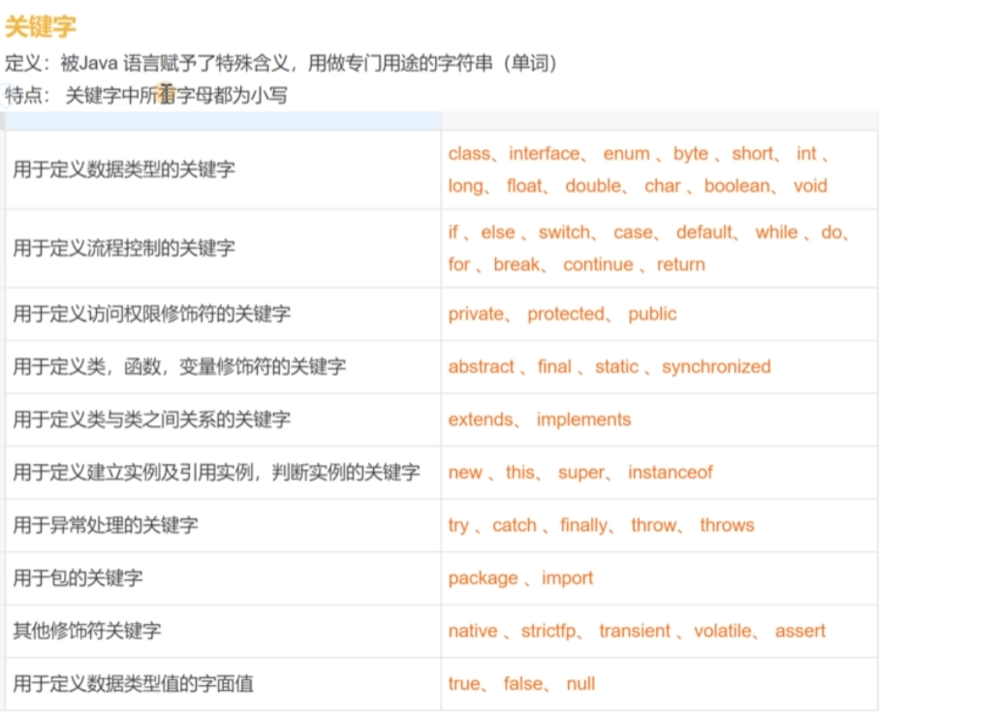

# 1, 关键字和保留字

## 关键字

被Java语言赋予了特殊含义，用做专门用途的字符串(单词)特点:关键字中所看字母都为小写

- 用于定义数据类型的关键字:
class, interface,  enum , byte , short,  int ,
long, float,  double, char, boolean,  void

- 用于定义流程控制的关键字:
if, else, switch， case,  default,  while, do,
for，break，continue, return

- 用于定义访问权限修饰符的关键字: private,  protected,  public

- 用于定义类，函数，变量修饰符的关键字: abstract, final, static, synchronized

- 用于定义类与类之间关系的关键字: extends, implements

- 用于定义建立实例及引用实例，判断实例的关键字: new, this,  super, instanceof

- 用于异常处理的关键字: try , catch, finally,  throw,  throws

- 用于包的关键字: package, import

- 其他修饰符关键字: native, strictfp,  transient, volatile,  assert

- 用于定义数据类型值的字面值 true, false, null

 

## 保留字

goto, const
