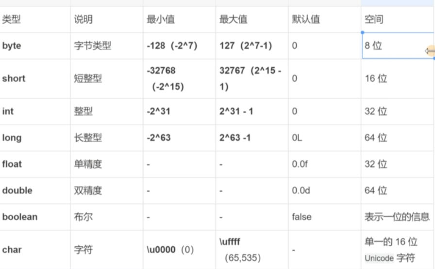

# 变量&数据类型

## 字节

是我们常见的计算机中最小存储单元, 计算机存储任何的数据, 都是以字节的形式存储。

8个bit(二进制位)0000-0000表示为1个字节, 写成1byte或者1B。

## Java基本数据类型

基本数据类型: 4类8种

- 布尔类型: boolean 数值只有2个: `true false`

- 字符类型: char 2b(16位) 单一的16位 Unicode 字符

- 整数类型:

byte: 字节, 1b(8bit)  `-2^7 ~ 2^7-1(-128 ~ 127)`

short: 短整型, 2b(16bit)  `-2^15 ~ 2^15-1(-32768 ~ 32767)`

int: 整型, (默认类型), `4b(32bit)  -2^31 ~ 2^31-`

long: 长整型, 加L或l, `8b(64bit)  -2^63 ~ 2^63-1`


```java
8 bit = 1 B
1024 B =1 KB
1024 KB =1 MB
1024 MB =1 GB
1024 GB = 1 TB
```

- 浮点类型:

float: 单精度, 加f或F, 4b(32bit)

double: 双精度, (默认类型), 8b(64bit)

基本数据类型是Java语言中内置的类型。整数类型、小数类型、字符类型、布尔类型这四类是最基础的类型

  

## 变量定义

变量包含三个要素： 数据类型, 变量名, 数据值

`数据类型 变量名 = 数据值`

注意:

- Java中每个变量必须先声明，后使用
- 使用变量名来访问这块区域的数据
- 变量的作用域:其定义所在的一对{}内
- 变量只有在其作用域内才有效
- 同一个作用域内，不能定义重名的变量

## 字符类型

ASCII(American Standard Code for Information Interchange)，美国标准信息交换码

在计算机内部，所有数据都使用二进制表示。每一个二进制位(bit)有0和1两种状态, 因此8个二进制位就可以组合出256 种状态，这被称为一个字节(byte)。一个字节一共可以用来表示256种不同的状态，每一个状态对应一个符号，就是 256个符号，从0000000到11111111

ASCII码: 上个世纪60年代，美国制定了一套字符编码，对英语字符与二进制位之间的关系，做了统一规定。这被称为ASCII码。ASCII码一共规定了128个字符的编码，比如空格“SPACE”是32(二进制00100000)，大写的字母A是65(二进制01000001)。这128个符号(包括32个不能打印出来的控制符号)，只占用了一个字节的后面7位，最前面的1位统一规定为0。

- GB2312 老国标
支持中文简体字和一部分少数民族文字
- GBK 新国标
支持中文简体字和少数民族文字
- UTF-8 万国码
支持世界上通用文字，也是后期开发中会使用的到的编码
JavaWEB项目HTML前端页面, 数据库软件编码集全部都是对应的UTF-8
- BIG5
中文繁体字编码，主要流行于中国香港，中国澳门，中国台湾省，新加坡
-ASCII码
美国标准信息交换协会制定的一个标准编码

Java中的所有字符都使用Unicode编码，故一个字符可以存储一个字母，一个汉字，或其他书面语的一个字符。

- Unicode中每个字符都对应一个二进制整数，可以使用多种方式赋值。
- 字符赋值:char c1=A';(通过描述为字符赋值)
- 整数赋值:char c2=65 (通过十进制数65在字符集中对应的字符赋值)
- 进制赋值:char c3='u0041' (通过十六进制数41在字符集中所对应的字符赋值)

## 转义字符

`\a` 换行符
`\t` 制表符

## 基本数据类型的转换

Java允许程序员在一定程度上进行数据类型的转换。

8种基本数据类型:

7种数值类型可以参加转换:byte，short，char，intlong，float,double(boolean不参加)。

### 显式转换

- 显式转换(强制转换):取值范围大的转为取值范围小的。
- 小范围数据类型变量=(小范围数据类型变量)大范围数据类型;
  int n=(int)6.7;
- 语法结构:(要转换的类型)数值

### 隐式转换

- 隐式转换(自动转换):取值范围小的转为取值范围大的。
- 大范围数据类型变量 = 小范围的数据类型;
  double d=10000;

数据范围从大到小:

double > float > long > int > short > byte
