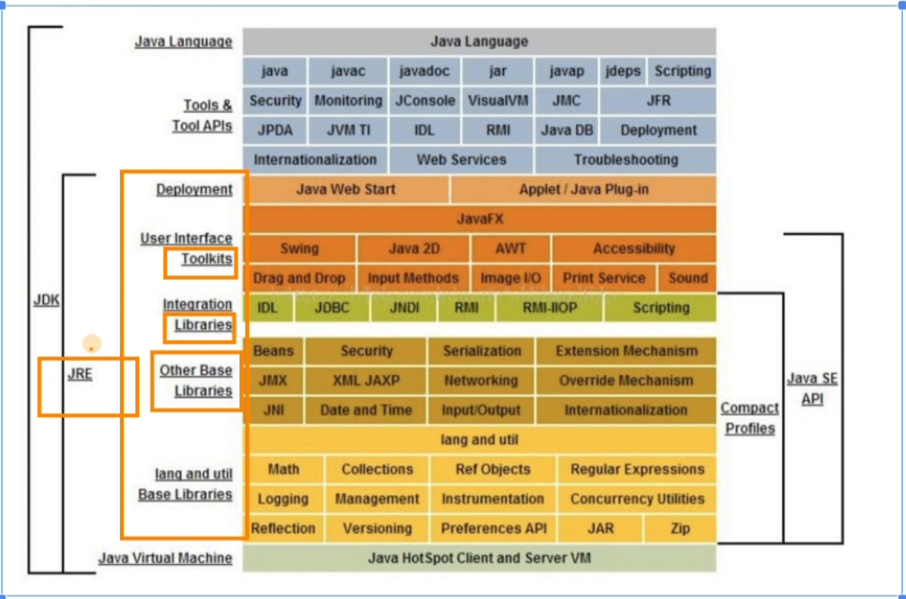

# Java环境

## JVM java虚拟机

Java virtual Machine: JAVA虚拟机， 是运行 Java 程序的假象计算机， 是Java的运行环境， 我们编写的Java代码，都运行在jvm上

跨平台： Java可以跨平台，但是需要安装jvm的对应版本

## JRE java Runtime Eviroment

## JDK Java Development Kit 开发者工具包

  
