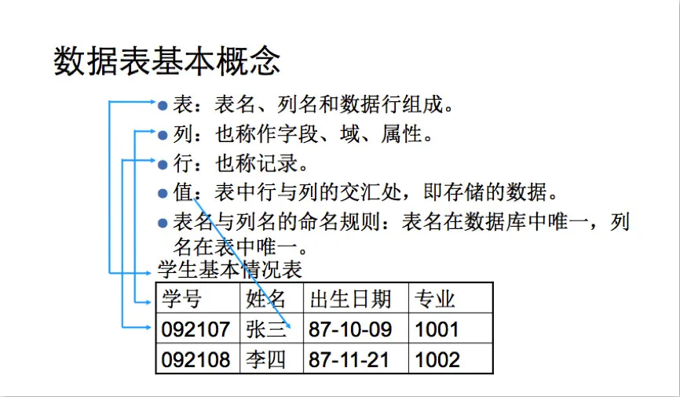

# 第14章 MySQL

## 一、引言

### 1.1  现有的数据存储方式有哪些？

- Java程序存储数据（变量、对象、数组、集合），数据保存在内存中，属于瞬时状态存储。
-  文件（File）存储数据，保存在硬盘上，属于持久状态存储。

### 1.2 以上存储方式存在哪些缺点？

- 没有数据类型的区分。
- 存储数据量级较小。
- 没有访问安全限制。
- 没有备份、恢复机制。

## 二、数据库基本知识

### 2.1 为什么需要数据库？

数据库的出现，很好的解决了数据的存储效率和读取效率。

存储成一个文件，不大方便操作，也不大方便共享

### 2.2 概念

>  数据库是“按照数据结构来组织、[存储和管理数据的仓库]()。是一个长期存储在计算机内的、有组织的、有共享的、统一管理的数据集合。

#### 2.2.1什么是数据库

数据库就是存储数据的仓库。为了方便数据的存储和管理，将数据按照特定的规则存储在磁盘上。通过数据管理系统，有效的组织和管理存储在数据库中的数据。
数据库（DATABASE）是按照数据结构来组织、存储和管理数据的仓库（通常是一个文件或一组文件）。
理解数据库的一种简单方法就是将其想象成一个文件柜，此文件柜是一个存储存放数据的位置

> 注意：有些人通常使用数据库这个术语来代表他们使用的数据库软件，这是不正确的。确切的说，数据库软件对应DBMS（数据库管理系统）。数据库是通过DBMS操纵的容器。我们不直接访问数据库，我们使用的是DBMS，它替我们访问数据库。

#### 2.2.2什么是数据库系统

数据库系统和数据库不是一个概念，数据库系统DBS比数据库大很多，由数据库，数据库管理系统，应用开发工具构成。
数据库，数据表，表的结构。。
DB：是指datebase（数据库）
数据库是存储数据的一个集合，数据库中通常使用数据表等组成，而数据表是由数据的字段和数据的值等信息组成。
DBMS:是指datebase mangement systerm（数据库管理系统）
它是操作数据库和管理数据库的一个系统，比如mysql、sqlserver等都是属于数据库管理软件，人们通过这些系统或者工具来管理数据库内的数据。
DBS:是指datebase systerm (数据库系统）
数据库系统由数据库和数据库管理软件等组成，数据库是一个逻辑上的存储数据的概念，而对应的是实体是数据库管理软件存储在硬盘上的数据库，所以数据库系统包含数据库和数据库管理软件。
比较一下DB,DBMS，DBS

### 2.3 数据库的分类

- 网状结构数据库：美国通用电气公司IDS（Integrated Data Store），以节点形式存储和访问。
- 层次结构数据库：IBM公司IMS（Information Management System）定向有序的树状结构实现存储和访问。
- 关系结构数据库：Oracle、DB2、MySQL、SQL Server，以表格（Table）存储，多表间建立关联关系，通过分类、合并、连接、选取等运算实现访问。
- 非关系型数据库：ElastecSearch、MongoDB、Redis，多数使用哈希表，表中以键值（key-value）的方式实现特定的键和一个指针指向的特定数据。

### 2.4关系型数据库的介绍

关系型数据库模型是吧复杂的数据结构归结为简单的二元关系（即二维表格形式）
在关系型数据库中，对数据的操作几乎全部建立在一个或多个关系的表格上，通过对这些关联的表格分裂、合并、连接或选取等运算来实现数据库的管理。
Oracle在数据库领域上升到了霸主地位
MySQL数据库在中小企业和免费市场具有绝对地位
关系型数据库的几个概念：
表：
>表（table）是数据库存储数据的基本单位。

 

>列(column)表中的一个字段。所有的表都是由一个或多个列组成

>数据类型（datatype)每个列都有相应的数据类型，用来限制该列存储的数据。

>行（row)表中的一个（行）记录
>表中的数据是按行存储的，所保存的每个记录存储在自己的行内，如果将表想象成网格，网格中垂直的列为表列，水平行为表行

>主键(primary key)一列或一组列，其值能够唯一区分表中的每一行。
>表中每一行都应该可以唯一标识自己的一列。一个顾客表可以使用顾客编号，而订单表可以使用订单ID。一个表中没有主键的话，更新或删除特定行的话很困难，因为没有相关的方法保证只涉及相关的行。
>主键的规则 表中的任何列都可以作为主键，只要它满足以下条件：

- 任何两行都不具有相同的主键值（每一行的主键值唯一）
- 每个行都必须具有主键值（主键值不允许null)

主键的好习惯除了强制的规则外，应该坚持的几个普遍认可的好习惯：

- 不更新主键列中的值
- 不重用主键列的值
- 不在主键列中使用可能更改的值

## 三、MySQL

### 3.1 简介

> MySQL是一个[关系型数据库管理系统]()，由瑞典MySQL AB 公司开发，属于 Oracle 旗下产品。MySQL 是最流行的关系型数据库管理系统之一，在 WEB 应用方面，MySQL是最好的 RDBMS(Relational Database Management System，关系数据库管理系统) 应用软件之一。

> 官方网站：https://www.mysql.com/
>下载地址：https://dev.mysql.com/downloads/mysql/

